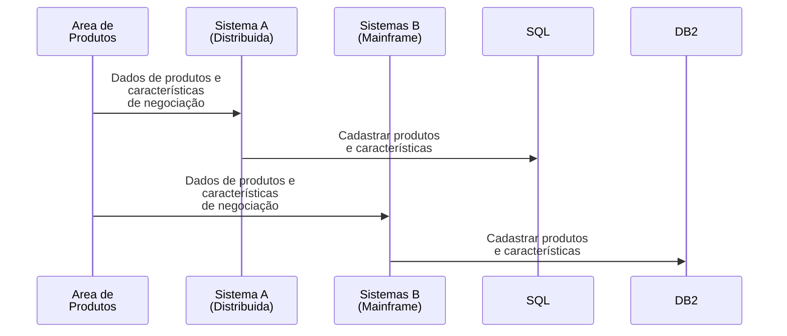
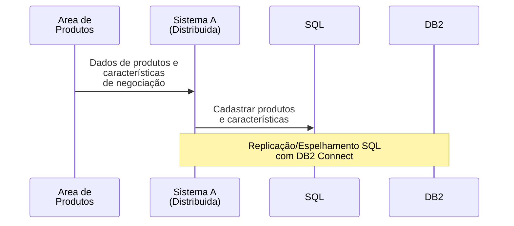

# Processo de Cadastro de Novos Produtos

## Fluxo Atual

## Desvantagens

- Cadastro do mesmo produto em dois sistemas diferentes, com características tecnológicas diferentes, exigindo customização individualizada em caso de alteração nas características do produto

- Alterações nos produtos precisam ser realizadas/verificadas nos dois sistemas, podendo levar à inconsistências

- Maior complexidade e demora no processo de idealização/cadastro do produto.

---

## Fluxo Proposto

## Vantagens

- Cadastro realizado em sistema único (Sistema A - Distribuído), mais recente e com tecnologias atualizadas, facilitando a alteração do sistema quanto às características dos produtos (sazonalidade, perfil de cliente, etc) , melhorando a agilidade e facilitando o processo para a Área de Produtos.

- Replicação automática e online das características dos produtos com a base de dados DB2 do Sistema B - Mainframe, garantindo consistência nas informações durante todo o processo.
