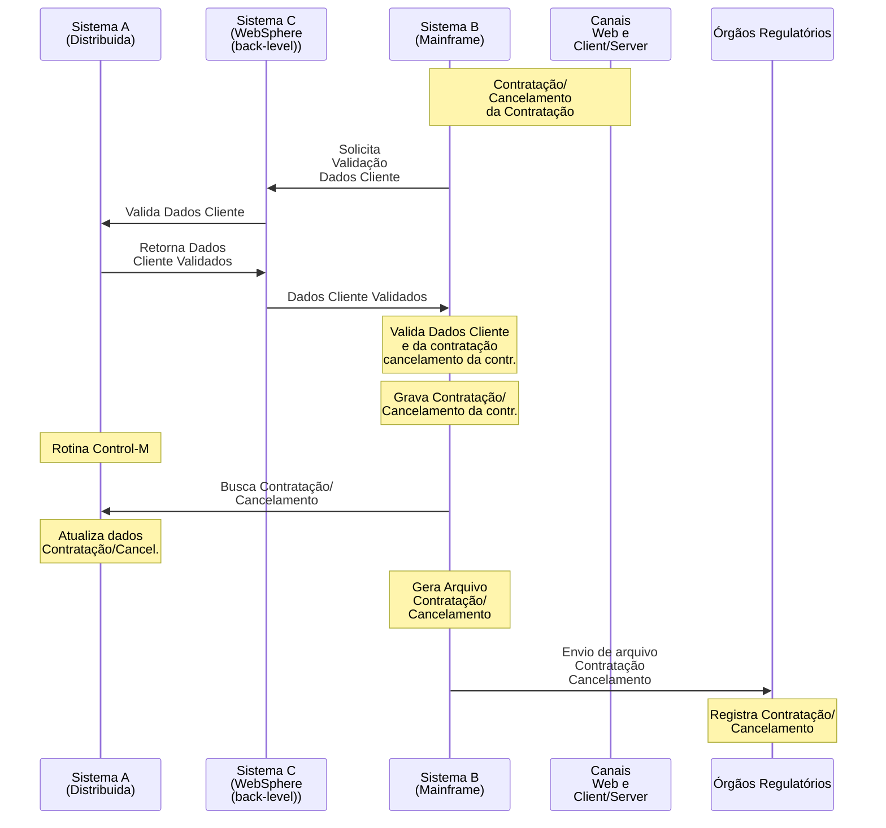
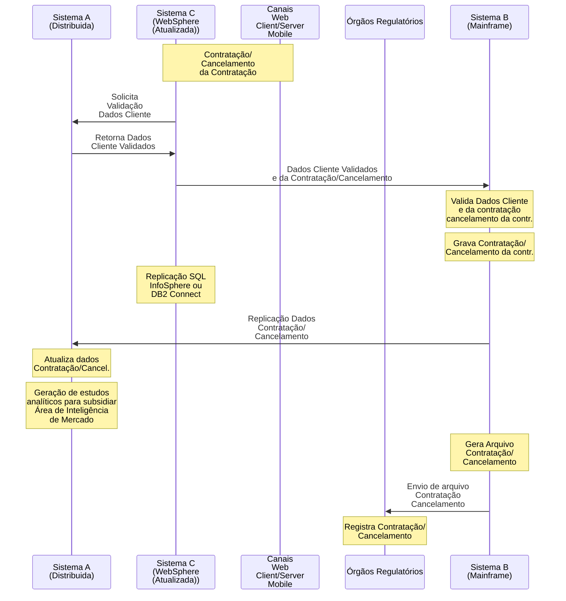

# Processo de Contratação de Produtos nos Canais Web e Client/Server

## Fluxo Atual

## Desvantagens

- Canal Mobile não é atendido por falta de integração sistêmica

- Sistema C (Websphere, em back-level) realiza somente função de integração entre outros dois sistemas (subutlizado)

- Dados de contratação/cancelamento são atualizados somente 1 vez ao dia no Sistema A (Distribuída), diminuindo a agilidade na análise e geração de estatísticas.

---

## Fluxo Proposto

## Vantagens

- A partir de uma única plataforma moderna, confiável e de alta disponibilidade implementando APIs baseadas em tecnologias atuais (RESTful API e JSON), obtém-se integração com todos os canais do banco, de forma automática e ágil.

- Possibilidade de geração de relatórios estatísticos e de análise do comportamento dos clientes de maneira imediata e online

- Geração de estudos analíticos, com dados atualizados e precisos, para subsidiar a Área de Inteligência de Mercado, a partir de plataforma Power BI
