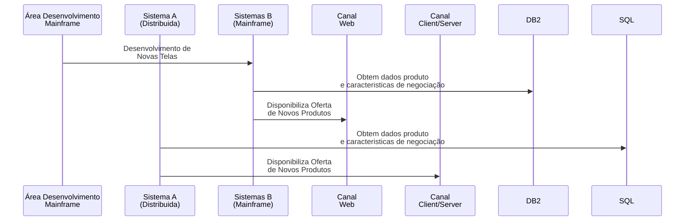
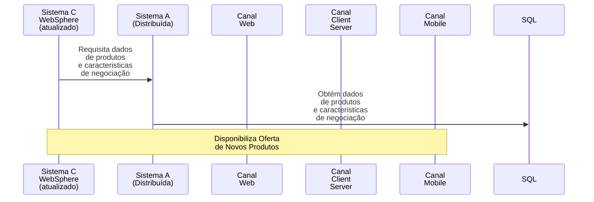

# Processo de Disponibilização das Ofertas de Novos Produtos nos Diferentes Canais

## Fluxo Atual

## Desvantagens

- Necessidade de desenvolvimento de novas telas a cada produto, no Canal Web

- Informações dos produtos e suas características obtidos de fontes diferentes (Sistema B - Mainframe para Canal Web, e Sistema A - Distribuída para Canal Client/Server), podendo gerar inconsistências na oferta.

- Canal Mobile não é atendido por qualquer dos Sistemas (A ou B), devido à falta de integração sistêmica.

---

## Fluxo Proposto

## Vantagens

- Obtenção das informações sobre Novos Produtos a partir de uma única fonte, consistênte e atualizada.

- A partir de uma única plataforma moderna, confiável e de alta disponibilidade implementando APIs baseadas em tecnologias atuais (RESTful API e JSON), obtém-se integração com todos os canais do banco, de forma automática e ágil.
